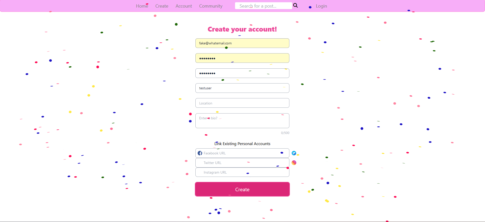
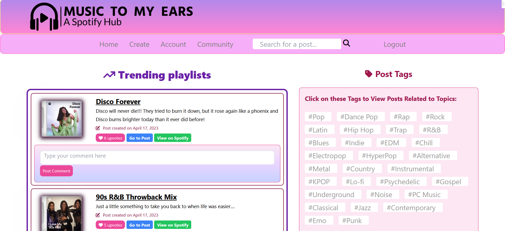
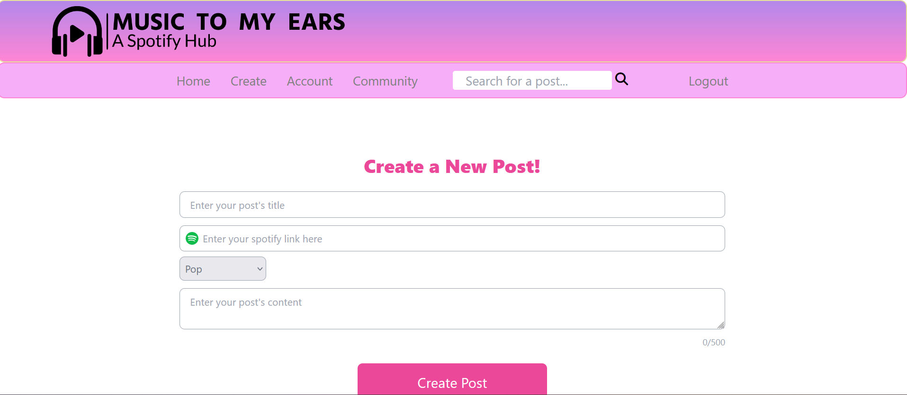
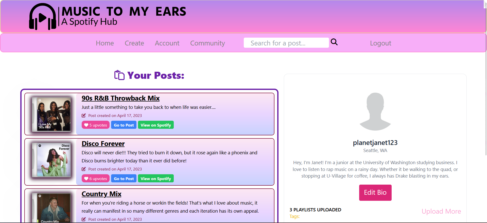
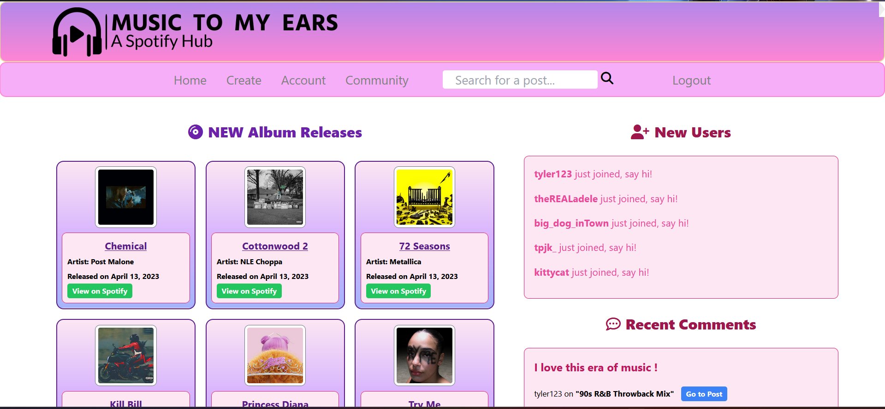

# 


## Table of Contents

- [Description](#description)
- [Installation](#installation)
- [Usage](#usage)
- [Contributors](#contributors)
- [Questions](#questions)
- [Screenshots](#screenshots)
- [License](#license)

---

## Description

Music to My Ears is a full stack web application that allows users to share their Spotify playlists to a user-friendly, interactive site. You can create your own account, post your own playlists, like or comment on other people's playlists, and more! You can see what the community is posting or interacting with, making it easy to engage with other users. When you view a post on the site, it gets information about the playlist to display its tracks right on the page. With Music to My Ears, finding music has never been easier!

External links 
- [GitHub Repository](https://github.com/Ally27/Music-to-My-Ears)
- [Webpage DEMO](https://www.loom.com/share/693a3100ec2043d99570dace81546b34)
- [Heroku Launched Link](https://music-to-my-ears1.herokuapp.com/)

---

## Installation
This project runs using node and SQL. Follow the necessary installation for these programs to download them to your local device. 
- After entering the mySQL terminal enter the code "SOURCE db/schema.sql" to create the music_db. Enter "quit" to return to the node.js command line.
- Then, in the CLI run the code "npm i" to install the necessary packages.
- After that, run the code "node seeds/index.js" into node to seed the music_db.
- Finally run the code "npm start" to begin the application and view it at "localhost:3001/" in your default browser. 

Note: you will need to create an .env file to store environment files to run the sequelize funtionalities
```
DB_NAME='music_db'
DB_USER='root'
DB_PASSWORD='YOURPASSWORD'
REDIRECT_URI_DECODED="http://localhost:3001/auth"
BASE64_AUTHORIZATION="NDRkZDYwN2QxOGY3NGFmNTkyODhjMjhlY2JiNzdhNjM6MjhmZDAxNWY1MDQ1NDcwMDhmMmNkNDgxNTEwYmI4YWU="
```

*** If you are viewing the webpage at the deployed Heroku link, then no installation is necessary! 

---

## Usage
Whether you're running this on a local host, or using the Heroku site usage is the same:
- Create an account or log in to an existing account.
- You're automatically navigated to the <b>"<u>Home</u>"</b> tab where you're able to view the top trending playlists on Music to My Ears! These posts are displayed with an easily interactable interface that allows comments, upvotes or viewing the playlist itself on our website or Spotify. The right side of the page shows all the tags, and allows users to click on them to view all the posts with that tag! The most recent playlists are also shown on the right side and the usercan click on them to view the post. 
- If you want to make a post, simply click on <b>"<u>Create</u>"</b> on the navbar. Add a title, tag and then a brief description. You also have to post your link to the spotify playlist. Click "Create Post" and we'll do the rest. 
- You can navigate to <b>"<u>Account</u>"</b> on the navbar to view all of your posts and your bio. You are shown your tags, how many playlists you've posted and a button to create more posts. You also can click on the "Edit Bio" to update the information on your profile! 
- Finally head over to the <b>"<u>Community</u>"</b> tab on the navbar. On the left side of the page you're shown the newest release albums from spotify, with the artist, release date and the option to view the album on spotify. The right side of the page is a major interaction-hub for the website! You see the newest users to signup and can click on them to view their profile. Additonally you see the most recent comments and navigate to the post they were on to join the discussion! Your top tags are shown to allow you to quickly navigate to all posts with a specific tag of interest to you. Finally, the newest posts are displayed with an easily interactable interface that allows comments, upvotes or viewing the playlist itself on Music to our Ears or Spotify. 

---

## Contributors

- [Tyler Kervella](https://github.com/tykervella)
- [Marley Schneider](https://github.com/marleyschneiderr)
- [Terri Mack](https://github.com/terrinmack)
- [Allyson Gonzalez](https://github.com/Ally27)

---

## Questions

Feel free to contact with any questions.
- Tyler Kervella - tylerkervella@gmail.com
- Marley Schneider - marleysue@gmail.com
- Terri Mack - terrimack15@gmail.com
- Allyson Gonzalez - allysonmg21@gmail.com

---

## Screenshots







---

## License


MIT LicContact
Copyright (c) 2023 Allyson Gonzales

Permission is hereby granted, free of charge, to any person obtaining a copy
of this software and associated documentation files (the "Software"), to deal
in the Software without restriction, including without limitation the rights
to use, copy, modify, merge, publish, distribute, sublicense, and/or sell
copies of the Software, and to permit persons to whom the Software is
furnished to do so, subject to the following conditions:

The above copyright notice and this permission notice shall be included in all
copies or substantial portions of the Software.

THE SOFTWARE IS PROVIDED "AS IS", WITHOUT WARRANTY OF ANY KIND, EXPRESS OR
IMPLIED, INCLUDING BUT NOT LIMITED TO THE WARRANTIES OF MERCHANTABILITY,
FITNESS FOR A PARTICULAR PURPOSE AND NONINFRINGEMENT. IN NO EVENT SHALL THE
AUTHORS OR COPYRIGHT HOLDERS BE LIABLE FOR ANY CLAIM, DAMAGES OR OTHER
LIABILITY, WHETHER IN AN ACTION OF CONTRACT, TORT OR OTHERWISE, ARISING FROM,
OUT OF OR IN CONNECTION WITH THE SOFTWARE OR THE USE OR OTHER DEALINGS IN THE
SOFTWARE.
